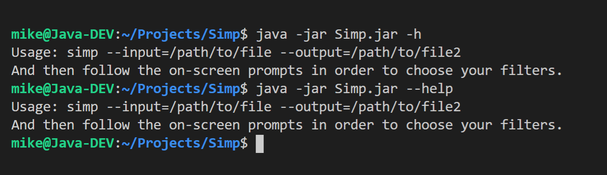

# Simp
A Simple Image Manipulation Program (SIMP) written in Java as a university assignment.

## Available filters
- Grayscale Filter
    - Average method
    - Weighted method
- Normalization Filter
- Negative Image filter
- Sobel Operator via Convolution Mask
- Prewitt Operator via Convolution Mask
- Image sharpening via Convolution Mask
- Image Smoothing (Blurring) via Convolution Mask
- Static Threshold grayscale to binary image filter
- Image mirroring
- Image rotation (clockwise and counter clockwise)
- Binary Operation between two images (AND, OR, XOR)
- Gray Level Histogram
- Red, Green and Blue Level Histograms
- Color Depth reduction via byte truncation
- Image translation (for x,y>0)
- Edge Extraction (if the laplacian/prewitt operators count)
- Zooming in (only for zoom levels >= 2)
    - Pixel replication method
    - Zero Order Hold method
    - K-times Zooming method (has a bug for zoom level > 2)
- Image Brightness adjustment
- Image Contrast Adjustment
- Gray level Histogram sliding (basically brightness adjust)
- Gray level Hiistogram Stretching (basically contrast adjustment)
- Gray Level Transforms
- Linear
    - Logarithmic
    - Power-Law
    - Laplacian Operator via Convolution Mask

## How to use
To run the `.jar` file available in the releases page, you run the following command: `java -jar Simp.jar`.

To see the `help` screen, use the `-h` or `--help` flags.

To specify an input file, use the `-i` or `--input` flag. To specify an output file, use the `-o` or `--output` flag.

Only after specifyin the `input` and `output` flags, in either long or short form, the program will start parsing the input file.  
If the file already exists, the program will ask if you wish to overwrite it.

You can check out the [before](./res/input/doggo.bmp) and [after](./res/output/doggo_out.bmp) images.

## The homework requirements

> 1. Implement at least one of the following DIP algorithms:
>     - Convert Color Image to Gray-ScaleImage – Average method
>     - Normalize colors
>     - Negative Image
>     - Level Adjustment(contrast and black/white adjustment)
>     - Sobel Operator
>     - Prewitt Operator
>     - Image Sharpening (convolution mask)
>     - Image Smoothing (convolution mask)
>     - Convert Gray-Scale Image to Binary image (Static Threshold)
>     - Image mirroring
>     - Binary Operation (AND, OR, XOR) between two images
>     - Gray Level Histogram of a Gray-Scale Image
>     - Decrease color depth Gray-Scale Image
>     - Rotate Image (90, 180, 270)
>     - Translate Image (X –Horizontal, Y –Vertical –prescribed by user)
>     - Edge Extraction(Detection)
>     - Converting Color Image to Gray-Scale Image – Weighted method (luminosity method)
>     - Image resizing (Zooming +/-) –keeping aspect ratio. Pixel replication  method
>     - Image resizing (Zooming +/-) –keeping aspect ratio. Zero order hold  method
>     - Image resizing (Zooming +/-) –keeping aspect ratio. Zooming K times  method
>     - Image Brightness modification
>     - Image Contrast modification
>     - Gray Level Histogram Sliding (+/-)
>     - Gray Level Histogram Stretching (+/-)
>     - Linear Gray Level Transform
>     - Logarithmic Gray Level Transform
>     - Power-Law Gray Level Transform
>     - Laplacian Operator (Positive/Negative)

See [first section](#available-filters)

> 2. The program must handle 24bit BMP files, and they must be read as raw data off the disk

The custom `BmpIO` class handles reading the image via the `Producer` and `Consumer` runnables, but writes it to the disk using `ImageIO.write()` (the hw only required us to READ the raw data, not to WRITE it too)

> 3. The code must adhere to all Coding Standards

All functions have a JavaDoc comment, major blocks of code have comments to explain the logic, variable names, class names, method names, etc all adhere to the coding standards, etc.

> 4. Must implement at least a 3-tiered inheritance hierarchy, at least 1 interface and at least 1 abstract class.

Examples of 3-tiered inheritance hierarchies:

1. `Generic Job` -> `Generic Filter` -> `Abstract Binary Filter` -> `AND Filter`
2. `Generic Job` -> `Generic Filter` -> `Abstract Binary Filter` -> `OR Filter`
3. `Generic Job` -> `Generic Filter` -> `Abstract Binary Filter` -> `XOR Filter`
4. `Generic Job` -> `Generic Filter` -> `Abstract Grayscale Filter` -> `Average Grayscale Filter`
    etc.

Interface: `IFilter`

Abstract Classes: `Generic Job`, `Generic Filter`, `Abstract Binary Filter`, etc.

> 5. Must handle exceptions in some way

All exceptions are rethrown and handled in the `App` class.

> 6. Must use the Producer-Consumer design pattern for reading the input file

See the `objects.runnables` package. It implements a `Producer` and a `Consumer` class, both of which implement the `Runnable` interface. They are implemented as separate threads inside `BmpIO`

> 7. Must keep track of execution times for all segments of the app

The `Timer` singleton is implemented to actually keep track of execution times via 2 hash maps. All classes that extend `Generic Job` have the `duration` field and they all implement a method that uses the `Timer` singleton.  
At the end of the program, a summary is shown, highlighting the exeecution time for each component;

## What I Learned
1. How to implement the Producer-Consumer design pattern
2. Some basic digital image processing algorithms
3. How to write a custom parser for various file formats (24-bit BMP in this case)

Overall, i found this project rather captivating, as I have never touched digital image processing before. While I know these are trivial algorithms, I enjoyed implementing them and I am happy ith the result.

Writing my own parser for the 24-bit BMP file format was... interesting, and a bit more challenging than I expected it to be.

I have never attempted to implement the `Producer-Consumer` design pattern before, so implementing it now was prime learning material. Ideally, I would have implemented my own custom `BlockingQueue`, but i ran our of time and energy.

## Feedback, suggestions and help

For feedback, suggestions, bug reports etc., feel free to e-mail me at 'mike.anth99@gmail.com'.

---

_a project by Mircea-Pavel Anton (Mike Anthony)_

